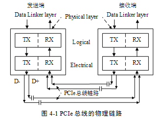

PCIe
=====
	
	Root Complex(RC) mode
	Endpoint (EP) mode
	
[ PCI Express Specification](https://pcisig.com/specifications)

[PDF of PCIe](https://www.mindshare.com/files/ebooks/PCI%20Express%20Technology%203.0.pdf)

Terms
-------

- Lane 数据通路。4线，2组差分线组成。

PCIe链路可以由多条Lane组成，目前PCIe链路可以支持1、2、4、8、12、16和32个Lane，即1、2、4、8、12、16和32宽度的PCIe链路。每一个Lane上使用的总线频率与PCIe总线使用的版本相关。

Host Side
------

Legacy Interrupt (INTx Emulation)
-----

Message Signaled Interrupt (MSI)
-------

sage signal interrupt，

:)
