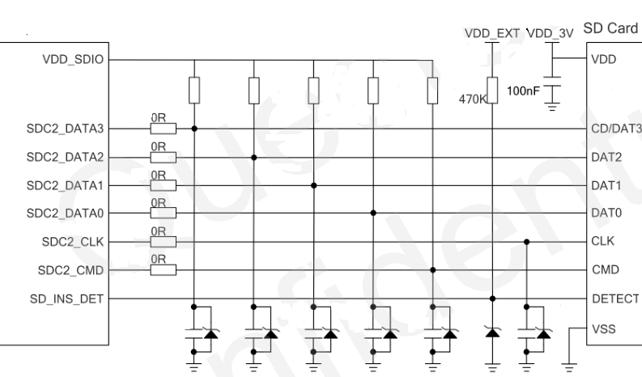
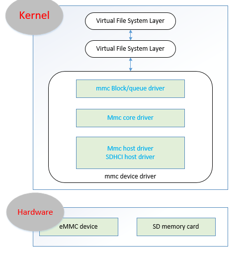

SDIO
=====

SDIO SD卡标准的，外设接口

|  属性类型   | MMC卡  | SD卡 | SDIO卡 |
|  ----  | ----  | --- | --- |
| 引脚数量  | 7 | 9  | 9 |
| 宽度  | 24mm | 24mm | 24mm |
| 长度  | 32mm | 32mm | 32+mm |
| 厚度  | 1.4mm | 2.1mm | 2.1mm |
| 1位传输模式 | Y | Y | Y |
| 4位传输模式 | N | 可选 | 可选 |
| SPI 传输 | 可选 | 支持 | 支持 |
| 最高SPI传输速率 | 20Mbit/s | 25Mbit/s | 25Mbit/s |
| 最高传输率 | 20Mbit/s | 100Mbit/s | 100Mbit/s |
| 时钟频率 | 0-20MHz | 0-25MHz | 0-25MHz |

通常用SDIO的设备		
	
	Wi-Fi card （无线网络卡）
	CMOS sensor card （照相模块）
	GPS card
	GSM/GPRS modem card
	Bluetooth card
	Radio/TV card

MMC 协议
------

[codingbelief eMMC 总线协议](https://linux.codingbelief.com/zh/storage/flash_memory/emmc/emmc_bus_protocol.html)

SD Card Hardware
--------

mmc/SD Linux framework
-------

内核里关于mmc部分代码由3部分组成

Host：又称主控制器层驱动，driver/mmc/host/，譬如包括sdhci-msm.c. 涉及SD/MMC协议。

Core：driver/mmc/core

Card：drver/mmc/card

设备号179

sysfs
-------

识别 SD 卡或者 EMMC 时，驱动已经将一些常用信息通过文件的形式创建在 sys 目录下。用户可以方
便的通过 cat 等命令查看设备信息。如下为常用命令： 
 
	ls /sys/block/mmcblk0-l 
	cat /sys/block/mmcblk0/size 
	cat /proc/self/mounts 
	cat /sys/block/mmcblk0/device/cid, csd, date, fwrev, hwrev, manfid, name, oemid, serial, type, uevent 

SDHCI 控制器

	root@colibri-imx6ull:~# dmesg | egrep "(sdhci|mmc)"
	[    1.880782] sdhci: Secure Digital Host Controller Interface driver
	[    1.890679] sdhci: Copyright(c) Pierre Ossman
	[    1.898540] sdhci-pltfm: SDHCI platform and OF driver helper
	[    1.909980] sdhci-esdhc-imx 2190000.usdhc: Got CD GPIO
	[    1.984346] mmc0: SDHCI controller on 2190000.usdhc [2190000.usdhc] using ADMA

插入 SD卡之前

	root@colibri-imx6ull:~# cat /proc/interrupts | egrep "(mmc|cd)"
	 58:          0       GPC  22 Level     mmc0
	200:          0  gpio-mxc   0 Edge      2190000.usdhc cd

此时IOs调试信息空

	root@colibri-imx6ull:~# cat /sys/kernel/debug/mmc0/ios
	clock:          0 Hz
	vdd:            0 (invalid)
	bus mode:       2 (push-pull)
	chip select:    0 (don't care)
	power mode:     0 (off)
	bus width:      0 (1 bits)
	timing spec:    0 (legacy)
	signal voltage: 0 (3.30 V)
	driver type:    0 (driver type B)

当SD卡插入的时候

	root@colibri-imx6ull:~# cat /sys/kernel/debug/gpio | grep cd
	gpio-128 (                    |cd                  ) in  hi IRQ

	root@colibri-imx6ull:~# cat /sys/kernel/debug/mmc0/ios
	clock:          50000000 Hz
	actual clock:   49500000 Hz
	vdd:            21 (3.3 ~ 3.4 V)
	bus mode:       2 (push-pull)
	chip select:    0 (don't care)
	power mode:     2 (on)
	bus width:      2 (4 bits)
	timing spec:    2 (sd high-speed)
	signal voltage: 0 (3.30 V)
	driver type:    0 (driver type B)

detect pin 拉低

	root@colibri-imx6ull:~# cat /sys/kernel/debug/gpio | grep cd
	gpio-128 (                    |cd                  ) in  lo IRQ

[SD/MMC Card Linux](https://developer.toradex.com/knowledge-base/sd-mmc-card-linux)

[MMC/SD/SDIO card support](https://www.kernel.org/doc/html/latest/driver-api/mmc/index.html)
