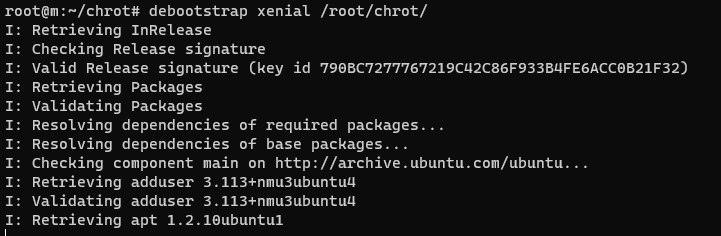
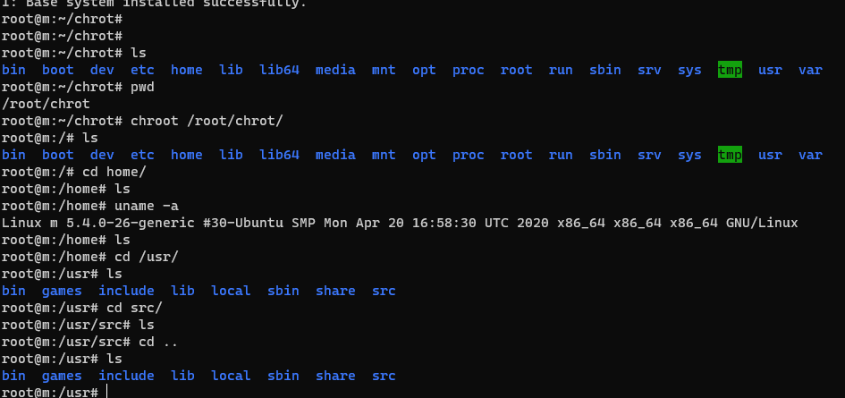

Ubuntu
=====

和Debian、Raspberry Pi系统没什么本质区别。问题是
> debian 文件系统如何搭建
> 如何构建一个完整的Ubuntu系统的SDK或者源码

debootstrap
------

什么是FHS?

What to do？

```debootstrap

sudo apt-get install debootstrap

sudo debootstrap --arch [平台] [发行版本代号] [目录]

for example: sudo debootstrap --arch i386 trusty /mnt

```

On Fedora, there is febootstrap.

[利用debootstrap构建一个可单独运行的镜像文件。](https://latelee.blog.csdn.net/article/details/102810405)








-----


