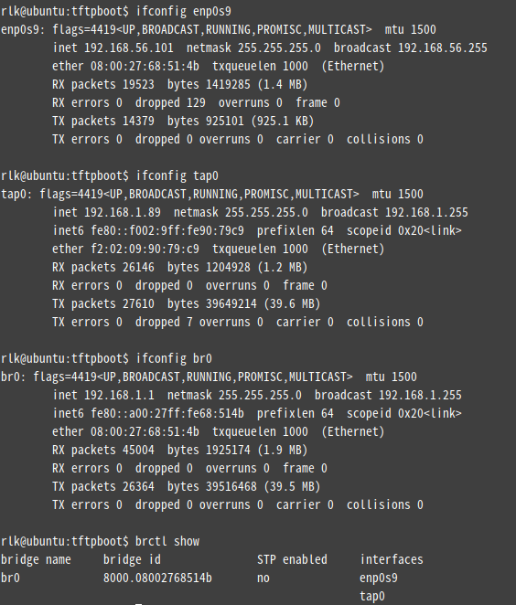

使用qemu搭建ARM Vexpress嵌入式linux开发环境
============

在arm开发板上成功运行Linux系统，我们有如下三个方面的任务：

	制作bootloader；
	编译linux内核、linux内核模块、linux设备树；
	制作根文件系统。

我们使用qemu虚拟机来上手嵌入式linux的开发。

安装qemu与arm交叉编译工具
--------

略

Linux内核与设备树编译
--------

下载Linux内核：https://www.kernel.org/

	git clone https://mirrors.tuna.tsinghua.edu.cn/git/linux.git

	https://mirror.bjtu.edu.cn/kernel/linux/kernel/

	make vexpress_defconfig

	make zImage 

	make modules

	make dtbs

得到zImage、dtb

尝试启动

	qemu-system-arm -M vexpress-a9 -m 512M -kernel arch/arm/boot/zImage -dtb arch/arm/boot/dts/vexpress-v2p-ca9.dtb -nographic -append "console=ttyAMA0"

看到

	rtc-pl031 10017000.rtc: setting system clock to 2020-11-02 09:39:39 UTC (1604309979)
	ALSA device list:
	  #0: ARM AC'97 Interface PL041 rev0 at 0x10004000, irq 33
	input: ImExPS/2 Generic Explorer Mouse as /devices/platform/smb/smb:motherboard/smb:motherboard:iofpga@7,00000000/10007000.kmi/serio1/input/input2
	VFS: Cannot open root device "(null)" or unknown-block(0,0): error -6
	Please append a correct "root=" boot option; here are the available partitions:
	1f00          131072 mtdblock0  (driver?)
	1f01           32768 mtdblock1  (driver?)
	Kernel panic - not syncing: VFS: Unable to mount root fs on unknown-block(0,0)
	CPU: 0 PID: 1 Comm: swapper/0 Not tainted 4.4.99 #1
	Hardware name: ARM-Versatile Express
	[<80016454>] (unwind_backtrace) from [<80012ee0>] (show_stack+0x10/0x14)
	[<80012ee0>] (show_stack) from [<80243aac>] (dump_stack+0x94/0xa8)
	[<80243aac>] (dump_stack) from [<800a5638>] (panic+0x9c/0x200)
	[<800a5638>] (panic) from [<8062f250>] (mount_block_root+0x1c0/0x25c)
	[<8062f250>] (mount_block_root) from [<8062f408>] (mount_root+0x11c/0x124)
	[<8062f408>] (mount_root) from [<8062f568>] (prepare_namespace+0x158/0x1a0)
	[<8062f568>] (prepare_namespace) from [<8062eeec>] (kernel_init_freeable+0x268/0x278)
	[<8062eeec>] (kernel_init_freeable) from [<804a440c>] (kernel_init+0x8/0xe8)
	[<804a440c>] (kernel_init) from [<8000f4f8>] (ret_from_fork+0x14/0x3c)
	---[ end Kernel panic - not syncing: VFS: Unable to mount root fs on unknown-block(0,0)

busybox
------

https://busybox.net/downloads/

编译生成一个 __install 文件夹

制作根文件系统
----

mkdir rootfs

将_install 目录里的内容拷贝到rootfs目录中

新建目录 mkdir lib

将arm交叉编译器的库复制过来：cp -r /usr/arm-linux-gnueabi/lib/* lib/

在rootfs目录下新建目录mkdir dev/，进入该目录cd dev/，创建节点sudo mknod -m 666 tty1 c 4 1（串口字符设备，主设备号为4，从设备号为1）

重复创建多个串口设备，注意分配好从设备号：

创建一个控制台节点：mknod -m 666 console c 5 1

创建一个空节点：mknod -m 666 null c 1 3

回到home目录，输入命令dd if=/dev/zero of=rootfs.ext3 bs=1M count=32生成虚拟SD卡系统镜像，可以得到一个rootfs.ext3文件。
格式化该镜像：mkfs.ext3 rootfs.ext3
挂载该镜像到本地：mount -t ext3 rootfs.ext3 /mnt -o loop

将之前准备的rootfs目录下的所有文件都拷贝到该镜像挂载点：cp -r /home/zvcv/rootfs/* /mnt/

卸载：umount /mnt/
进入linux源码目录： cd linux/

使用qemu启动内核：qemu-system-arm -M vexpress-a9 -m 512M -kernel arch/arm/boot/zImage -dtb arch/arm/boot/dts/vexpress-v2p-ca9.dtb -nographic -append "root=/dev/mmcblk0 rw console=ttyAMA0" -sd /home/zvcv/rootfs.ext3，这里比之前多指定了一个sd镜像。

点击回车，进入命令行，linux启动完毕。

**我遇到了无法启动，原因是内核编译选项选的是ext4 ，所以格式化的时候选mkfs.ext4**

uboot
-----

https://ftp.denx.de/pub/u-boot/

不要用最新版本

	scripts/kconfig/conf  --syncconfig Kconfig
	  UPD     include/config.h
	  GEN     include/autoconf.mk.dep
	  CFG     u-boot.cfg
	  GEN     include/autoconf.mk
	  UPD     include/generated/dt.h
	  UPD     include/generated/timestamp_autogenerated.h
	  UPD     include/config/uboot.release
	*** Your GCC is older than 6.0 and is not supported
	arch/arm/config.mk:66: recipe for target 'checkgcc6' failed
	make: *** [checkgcc6] Error 1

我的arm-linux-gnuebi-gcc 是5.5

换2015年的uboot才能build pass

NFS
----

>    sudo apt-get install uml-utilities bridge-utils

> cd linux-4.4.232/

> make LOADADDR=0x60003000 uImage -j4

mkimage command not found  U-Boot images will not be built --->

**sudo apt-get install u-boot-tools** 

> sudo apt-get install tftp-hpa tftpd-hpa xinetd

u-boot 要能加载uImage，需要修改

默认的bootcmd，变成tftp加载tftp server上的uImage

vim include/configs/vexpress_common.h

注释默认的 CONFIG_BOOTCOMMAND

添加 

	#define CONFIG_BOOTCOMMAND  "tftp 0x60003000 uImage; setenv bootargs'root=/dev/mmcblk0 console=ttyAMA0'; bootm 0x60003000"

另外一个说法是

	#define CONFIG_BOOTCOMMAND  "tftp 0x60003000 uImage; tftp 0x60500000 vexpress-v2p-ca9.dtb; setenv bootargs 'root=/dev/mmcblk0 console=ttyAMA0'; bootm 0x60003000 - 0x60500000"

可以配置IP和netmask

	#define CONFIG_IPADDR   192.168.1.49
	#define CONFIG_NETMASK  255.255.255.0
	#define CONFIG_SERVERIP 192.168.1.88

在Quectel的台式机虚拟机里的桥接网卡，实际配置成

	#define CONFIG_IPADDR   192.168.1.49
	#define CONFIG_NETMASK  255.255.254.0
	#define CONFIG_SERVERIP 10.66.83.84

QEMU和主机如何ping通
----

在Ubuntu下使用QEMU连网
[https://blog.csdn.net/yang1111111112/article/details/107811796](https://blog.csdn.net/yang1111111112/article/details/107811796)

写一个脚本

	if test -z $1 ; then
		echo need a argument: down/up
		exit
	fi 
	
	if [ "up" = $1  ] ; then
		# 新建一个网桥，名称为br0
		brctl addbr br0
		# 将网络设备enp0s10添加到网桥br0 
		ifconfig enp0s9 down
		brctl addif br0 enp0s9
	
		# 关闭生成树协议
		brctl stp br0 off
	
		ifconfig br0 192.168.1.1 netmask 255.255.255.0 promisc up
		ifconfig enp0s9 192.168.1.88 netmask 255.255.255.0 promisc up
	
	
		 # 使用命令tunctl添加虚拟网卡tap
		tunctl -t tap0 -u rlk
	
		ifconfig tap0 192.168.1.89 netmask 255.255.255.0 promisc up
	
		brctl addif br0 tap0
	
	else
		ifconfig tap0 down
		brctl delif br0 tap0
	
		ifconfig enp0s9 down
		brctl delif br0 enp0s9
		ifconfig br0 down
		brctl delbr br0

		ifconfig enp0s9 192.168.1.88 netmask 255.255.255.0
	fi

其中enp0s9是VirtualBox里的一个Host Only添加的网卡。

生成的这个tap0 就是serverip
在qemu中可以ping 通该IP 

	sudo qemu-system-arm -M vexpress-a9 -m 1024M -kernel u-boot -dtb /home/rlk/QEMU/tftpboot/vexpress-v2p-ca9.dtb  -nographic -net nic,macaddr=52:54:00:12:34:22 -net tap,ifname=tap0 -sd  vexpress.ext3

在uboot里，
setenv serverip xxx
setenv ipaddr xxx
ping ${serverip}

网络能ping通的情况下

tftp 0x60003000 uImage
setenv bootargs 'root=/dev/mmcblk0 console=ttyAMA0'
bootm 0x60003000

NFS
----

RT Thread
---

Ubuntu 平台开发RT-Thread

qemu 模拟 ARM 从sd卡启动 uboot 内核
-----

[http://www.vjiot.net/typecho/index.php/archives/58/](http://www.vjiot.net/typecho/index.php/archives/58/)

:)
