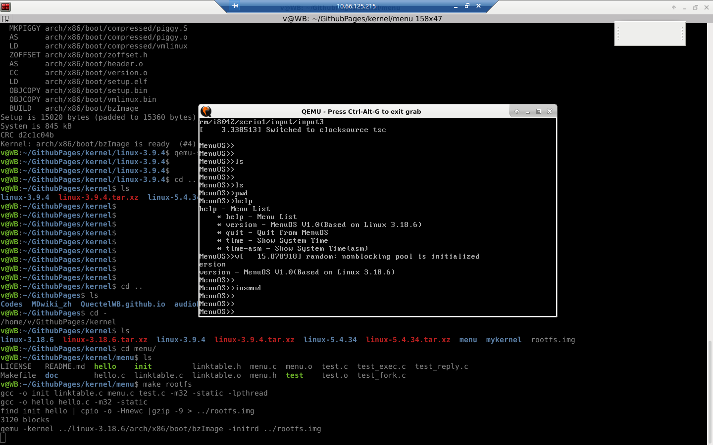

menu
====

From 孟宁老师的git仓库。

https://github.com/mengning/menu.git

Prepare to Do
----
	
	update-alternatives --install /usr/local/bin/qemu qemu /usr/local/bin/qemu-system-i386 386
	
	apt-get install gcc-5 gcc-5-multilib 
	
	axel -n 20 https://www.kernel.org/pub/linux/kernel/v3.x/linux-3.18.6.tar.xz
	
	tar -xvf linux-3.18.6.tar.xz
	
	make i386_defconfig
	
	make menuconfig
	kernel hacking
	--> Compile-time checks and compiler options
	[*]compile the kernel with debug info
	
	make
	
	git clone https://github.com/mengning/menu.git
	
	
	gcc -o init linktable.c menu.c test.c -m32 -static -lpthread
	gcc -o hello hello.c -m32 -static
	find init hello | cpio -o -Hnewc |gzip -9 > ../rootfs.img
	qemu -kernel ../linux-3.18.6/arch/x86/boot/bzImage -initrd ../rootfs.img

init 是系统1号进程
	

	
cmdline menu libary

example code 
----

    #include <stdio.h>
    #include <stdlib.h>
    #include "menu.h"
    
    int Quit(int argc, char *argv[])
    {
        /* add XXX clean ops */
        exit(0);
    }
    
    int main()
    {
    
        MenuConfig("version","XXX V1.0(Menu program v1.0 inside)",NULL);
        MenuConfig("quit","Quit from XXX",Quit);
        
        ExecuteMenu();
    }

## User Links

* [工程化编程实战](https://mooc.study.163.com/course/1000103000?_trace_c_p_k2_=2b68c5974ba8438894c4518ef342e21b&share=2&shareId=1000001002#/info)
* [代码中的软件工程](https://gitee.com/mengning997/se/blob/master/README.md#%E4%BB%A3%E7%A0%81%E4%B8%AD%E7%9A%84%E8%BD%AF%E4%BB%B6%E5%B7%A5%E7%A8%8B)
* [庖丁解牛Linux内核](https://mooc.study.163.com/course/1000072000?_trace_c_p_k2_=3f48b65c40864fdba6b25b986796ac82&share=2&shareId=1000001002#/info)
