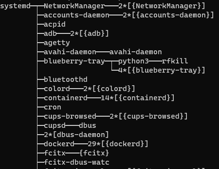

learn a cmd each day
======

每天熟悉一个命令


pstree
----



```help
pstree: unrecognized option '--help'
用法：pstree [-acglpsStTuZ] [ -h | -H 进程号 ] [ -n | -N 类型 ]
              [ -A | -G | -U ] [ 进程号 | 用户 ]
  或：pstree -V

显示进程树。

  -a, --arguments     显示命令行参数
  -A, --ascii         使用 ASCII 行绘制字符
  -c, --compact-not   不要对完全相同的子树进行压缩
  -C, --color=类型    按照指定属性对进程上色
                      (age)
  -g, --show-pgids    显示进程组 ID；隐含启用 -c 选项
  -G, --vt100         使用 VT100 行绘制字符
  -h, --highlight-all 高亮显示当前进程和其所有祖先
  -H PID, --highlight-pid=PID
                      高亮显示指定 PID 对应的进程和其所有祖先
  -l, --long          不要截断长行
  -n, --numeric-sort  按照 PID 对输出进行排序
  -N 类型, --ns-sort=类型
                      按照指定命名空间类型对输出进行排序
                              (cgroup, ipc, mnt, net, pid, user, uts)
  -p, --show-pids     显示 PID；隐含启用 -c 选项
  -s, --show-parents  显示所选进程的父进程
  -S, --ns-changes    显示命名空间的变化
  -t, --thread-names  显示完整线程名称
  -T, --hide-threads  隐藏线程，只显示进程
  -u, --uid-changes   显示用户 ID（UID）的变化
  -U, --unicode       使用 UTF-8（Unicode）的行绘制字符
  -V, --version       显示版本信息
  -Z, --security-context
                      显示 SELinux 安全上下文

  进程号 从指定进程号开始；默认为 1（init）
  用户   仅显示从指定用户的进程开始的进程树
```


pidof
-------

root@m:/usr/src/linux-headers-5.4.0-26-generic/include# ps -a
    PID TTY          TIME CMD
   2097 pts/0    00:00:00 sudo
   2948 pts/1    00:00:00 bash
   2969 pts/0    00:00:00 tmux: client
  45805 pts/9    00:00:00 ps
root@m:/usr/src/linux-headers-5.4.0-26-generic/include# pidof tmux
2971 2969


chroot
------

命令用于改变根目录


xargs
-----

xargs 是一个强有力的命令，它能够捕获一个命令的输出，然后传递给另外一个命令。

somecommand |xargs -item  command

-a file 从文件中读入作为sdtin
-e flag ，注意有的时候可能会是-E，flag必须是一个以空格分隔的标志，当xargs分析到含有flag这个标志的时候就停止。
-p 当每次执行一个argument的时候询问一次用户。
-n num 后面加次数，表示命令在执行的时候一次用的argument的个数，默认是用所有的。
-t 表示先打印命令，然后再执行。
-i 或者是-I，这得看linux支持了，将xargs的每项名称，一般是一行一行赋值给 {}，可以用 {} 代替。
-r no-run-if-empty 当xargs的输入为空的时候则停止xargs，不用再去执行了。
-s num 命令行的最大字符数，指的是 xargs 后面那个命令的最大命令行字符数。
-L num 从标准输入一次读取 num 行送给 command 命令。
-l 同 -L。
-d delim 分隔符，默认的xargs分隔符是回车，argument的分隔符是空格，这里修改的是xargs的分隔符。
-x exit的意思，主要是配合-s使用。。
-P 修改最大的进程数，默认是1，为0时候为as many as it can ，这个例子我没有想到，应该平时都用不到的吧。


VIM r
-----

:r
可以把其他文本文件内容插入到当前文件中


列出ubuntu上所有的服务
-------

systemctl list-units --all --type=service


将当前文件中除了src目录全部移动到src目录
-----
mv `ls | grep -v src | xargs` src

xargs 将ls 的结果作为一行

grep -v 反向

:)

