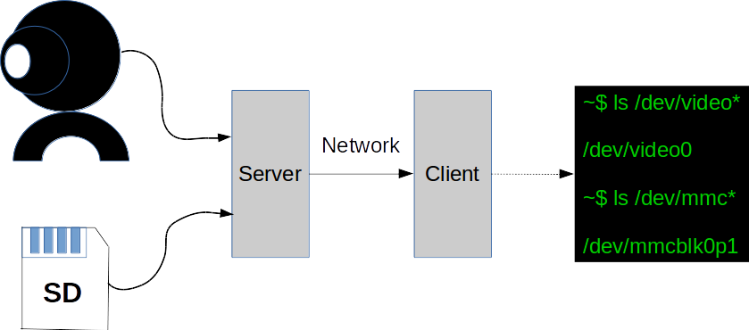

MISC
=====

Hard to clarify...

locales
----

locale 是Ubuntu/Centos 用于语言环境本地化。

远程SSH 连了自己平板电脑上的WSL环境，Ubuntu环境的工作OK，但是Debian的WSL环境却出现了输入中文字符，VIM里出现无法识别的情况，出现了各种方块。
和locale有关。

之前在EC25E上移植TMUX，没成功，最后也是这个问题需要配置。

实际上Debian上支持locale，执行dpkg-reconfigure locales 也能配置，但是返回有报错，并且最终没有生效。
直接修改/etc/default/locale ，重启后也不行。

	apt-get remove --purge locales -y
	apt-get install locales -y

卸载重装解决问题。


后来重启后，一切恢复了，中文又再次无法


export LC_ALL=zh_CN.UTF-8

世界宁静

alais
-----

给命令起别名

alias ls="ls --color"


UsbIp
-----

USB over IP , A great feature



[How_to_setup_and_use_USB/IP](https://developer.ridgerun.com/wiki/index.php?title=How_to_setup_and_use_USB/IP)

```Example 

q@q-OptiPlex-7070:~$ /usr/lib/linux-tools/5.4.0-52-generic/usbip list -l
usbip: error: failed to open /usr/share/hwdata//usb.ids
 - busid 1-12 (413c:2113)
   unknown vendor : unknown product (413c:2113)

 - busid 1-5.4 (1976:4082)
   unknown vendor : unknown product (1976:4082)

q@q-OptiPlex-7070:~$ /usr/lib/linux-tools/5.4.0-52-generic/usbip list -r 10.66.125.234
usbip: error: failed to open /usr/share/hwdata//usb.ids
Exportable USB devices
======================
 - 10.66.125.234
        1-4: unknown vendor : unknown product (2c7c:0125)
           : /sys/devices/pci0000:00/0000:00:14.0/usb1/1-4
           : unknown class / unknown subclass / unknown protocol (ef/02/01)

q@q-OptiPlex-7070:~$ sudo /usr/lib/linux-tools/5.4.0-52-generic/usbip attach -r 10.66.125.234 -b 1-4

q@q-OptiPlex-7070:~$ lsusb
Bus 004 Device 001: ID 1d6b:0003 Linux Foundation 3.0 root hub
Bus 003 Device 002: ID 2c7c:0125 Quectel Wireless Solutions Co., Ltd. EC25 LTE modem
Bus 003 Device 001: ID 1d6b:0002 Linux Foundation 2.0 root hub
Bus 002 Device 001: ID 1d6b:0003 Linux Foundation 3.0 root hub
Bus 001 Device 004: ID 1976:4082 Chipsbrand Microelectronics (HK) Co., Ltd.
Bus 001 Device 002: ID 1a40:0101 Terminus Technology Inc. Hub
Bus 001 Device 005: ID 413c:2113 Dell Computer Corp. Dell KB216 Wired Keyboard
Bus 001 Device 001: ID 1d6b:0002 Linux Foundation 2.0 root hub


[711228.658191] vhci_hcd vhci_hcd.0: USB/IP Virtual Host Controller
[711228.658193] vhci_hcd vhci_hcd.0: new USB bus registered, assigned bus number 3
[711228.658197] vhci_hcd: created sysfs vhci_hcd.0
[711228.658219] usb usb3: New USB device found, idVendor=1d6b, idProduct=0002, bcdDevice= 5.04
[711228.658220] usb usb3: New USB device strings: Mfr=3, Product=2, SerialNumber=1
[711228.658220] usb usb3: Product: USB/IP Virtual Host Controller
[711228.658221] usb usb3: Manufacturer: Linux 5.4.0-48-generic vhci_hcd
[711228.658222] usb usb3: SerialNumber: vhci_hcd.0
[711228.658359] hub 3-0:1.0: USB hub found
[711228.658363] hub 3-0:1.0: 8 ports detected
[711228.658459] vhci_hcd vhci_hcd.0: USB/IP Virtual Host Controller
[711228.658460] vhci_hcd vhci_hcd.0: new USB bus registered, assigned bus number 4
[711228.658477] usb usb4: We don't know the algorithms for LPM for this host, disabling LPM.
[711228.658491] usb usb4: New USB device found, idVendor=1d6b, idProduct=0003, bcdDevice= 5.04
[711228.658491] usb usb4: New USB device strings: Mfr=3, Product=2, SerialNumber=1
[711228.658492] usb usb4: Product: USB/IP Virtual Host Controller
[711228.658493] usb usb4: Manufacturer: Linux 5.4.0-48-generic vhci_hcd
[711228.658493] usb usb4: SerialNumber: vhci_hcd.0
[711228.658595] hub 4-0:1.0: USB hub found
[711228.658599] hub 4-0:1.0: 8 ports detected
[711574.023109] usbcore: registered new device driver usbip-host
[711696.394509] vhci_hcd vhci_hcd.0: pdev(0) rhport(0) sockfd(3)
[711696.394510] vhci_hcd vhci_hcd.0: devid(65602) speed(3) speed_str(high-speed)
[711696.629478] usb 3-1: new high-speed USB device number 2 using vhci_hcd
[711696.769483] usb 3-1: SetAddress Request (2) to port 0
[711696.837940] usb 3-1: New USB device found, idVendor=2c7c, idProduct=0125, bcdDevice= 3.18
[711696.837947] usb 3-1: New USB device strings: Mfr=1, Product=2, SerialNumber=0
[711696.837950] usb 3-1: Product: Android
[711696.837953] usb 3-1: Manufacturer: Android
[711696.962058] usbcore: registered new interface driver usbserial_generic
[711696.962063] usbserial: USB Serial support registered for generic
[711697.126640] usbcore: registered new interface driver option
[711697.126647] usbserial: USB Serial support registered for GSM modem (1-port)
[711697.126694] option 3-1:1.0: GSM modem (1-port) converter detected
[711697.126788] usb 3-1: GSM modem (1-port) converter now attached to ttyUSB0
[711697.126810] option 3-1:1.1: GSM modem (1-port) converter detected
[711697.126869] usb 3-1: GSM modem (1-port) converter now attached to ttyUSB1
[711697.126889] option 3-1:1.2: GSM modem (1-port) converter detected
[711697.126917] usb 3-1: GSM modem (1-port) converter now attached to ttyUSB2
[711697.126935] option 3-1:1.3: GSM modem (1-port) converter detected
[711697.126961] usb 3-1: GSM modem (1-port) converter now attached to ttyUSB3
[711697.126990] option 3-1:1.5: GSM modem (1-port) converter detected
[711697.127014] option 3-1:1.6: GSM modem (1-port) converter detected
[711697.127035] option 3-1:1.7: GSM modem (1-port) converter detected
[711697.135638] usbcore: registered new interface driver cdc_wdm
[711697.169606] qmi_wwan 3-1:1.4: cdc-wdm1: USB WDM device
[711697.174201] qmi_wwan 3-1:1.4 wwan0: register 'qmi_wwan' at usb-vhci_hcd.0-1, WWAN/QMI device, 2e:07:fd:3d:7e:a5
[711697.174241] usbcore: registered new interface driver qmi_wwan
[711697.351729] mc: Linux media interface: v0.10
[711697.413620] usbcore: registered new interface driver snd-usb-audio
[711699.152259] vhci_hcd: unlink->seqnum 51
[711699.152260] vhci_hcd: urb->status -104
[711699.264750] vhci_hcd: unlink->seqnum 62
[711699.264752] vhci_hcd: urb->status -104


```

进程绑定CPU
----


[linux下把进程/线程绑定到特定cpu核上运行](https://blog.csdn.net/guotianqing/article/details/80958281)

CPU Core

	cat /proc/cpuinfo | grep "physical id" | sort | uniq | wc -l

查看进程绑定在哪个CPU
	
	taskset -cp 进程PID

绑定进程到CPU
	
	taskset -cp cpu核序号 进程PID


dd 命令的iflags
-----

xxx

swap 分区
-----

swap 在windows PC上也有这个功能，就是把硬盘的一部分空间当作内存使用，用来应付内存不足的情况。

该区域也不宜设置过大，否则OS就不会节约使用内存。

/etc/fstab

磁盘被手动挂载之后都必须把挂载信息写入/etc/fstab这个文件中，否则下次开机启动时仍然需要重新挂载。
系统开机时会主动读取/etc/fstab这个文件中的内容，根据文件里面的配置挂载磁盘。

https://blog.csdn.net/kepa520/article/details/81315430


strace
----

原理是跟踪进程和信号的系统调用


strace cat /dev/null

execve("/usr/bin/cat", ["cat", "/dev/null"], 0x7ffe960fe6b8 /* 26 vars */) = 0
brk(NULL)                               = 0x55f11ab99000
arch_prctl(0x3001 /* ARCH_??? */, 0x7ffebb813ff0) = -1 EINVAL (无效的参数)
access("/etc/ld.so.preload", R_OK)      = -1 ENOENT (没有那个文件或目录)
...


	strace -tt -T -v -f -e trace=file -o /data/log/strace.log -s 1024 -p 23489

- -tt 在每行输出的前面，显示毫秒级别的时间
- -T 显示每次系统调用所花费的时间
- -v 对于某些相关调用，把完整的环境变量，文件stat结构等打出来。
- -f 跟踪目标进程，以及目标进程创建的所有子进程
- -e 控制要跟踪的事件和跟踪行为,比如指定要跟踪的系统调用名称
- -o 把strace的输出单独写到指定的文件
- -s 当系统调用的某个参数是字符串时，最多输出指定长度的内容，默认是32个字节
- -p 指定要跟踪的进程pid, 要同时跟踪多个pid, 重复多次-p选项即可。

跟踪nginx, 看其启动时都访问了哪些文件

	strace -tt -T -f -e trace=file -o /data/log/strace.log -s 1024 ./nginx

[strace命令用法](https://blog.csdn.net/cs729298/article/details/81906375)

strace也不是真正的万能。当目标进程卡死在用户态时，strace就没有输出了。

这个时候我们需要其他的跟踪手段，比如gdb/perf/SystemTap等。

备注：
	
	1、perf原因kernel支持
	
	2、ftrace  kernel支持可编程
	
	3、systemtap 功能强大，RedHat系统支持，对用户态，内核态逻辑都能探查，使用范围更广

dmesg 的ring buffer
-------------------------

dmesg -s 指定唤醒缓冲器大小


ps top 查看进程运行在哪个cpu上
-----

	ps -eo pid,args,psr
	
	psr 
	
	ps -o pid,psr,comm -p <pid>
	
[判断Linux进程在哪个CPU核运行的方法](https://www.cnblogs.com/snooker/p/10942566.html)


ping
-----------

TTL<br>

当我们在使用 ping 命令时，返回结果里会带一个 TTL 值。这个东西的含义其实就是Time To Live，指的是报文在网络中能够存活的限制。以前这个限制方式是设定一个时间（Time To Live中的Time就是这样来的），当报文在网络中转发时，时间超过这个限制，最后一个收到报文的路由点就会把它扔掉，而不继续转发。后来把时间限制改为了跳数限制，就是当报文在网络中转发时，每经过一个路由点，就把预先设定的这个TTL数值减 1，直到最后 TTL=1 时报文就被扔掉，不向下转发。

路由点：我这里是指完成路由功能的机器，因为并不是只有路由器才可以完成路由转发功能，比如主机可以配置路由转发。

所以，回包中的 TTL 表示目标主机返回的报文到达本机后，从它预设的 TTL 值减小到现在的值。
<br>

临时开启 ping。

	echo 0 > /proc/sys/net/ipv4/icmp_echo_ignore_all

临时禁用 ping。

	echo 1 > /proc/sys/net/ipv4/icmp_echo_ignore_all 


epoll和/proc
---------

当创建好epoll句柄后，它就是会占用一个fd值，在linux下如果查看/proc/进程id/fd/，是能够看到这个fd的，所以在使用完epoll后，必须调用close()关闭，否则可能导致fd被耗尽。

epoll创建的fd是：

	lrwx------ 1 root root 64 Aug 20 11:04 3 -> anon_inode:[eventpoll]

这种类型的inode，是epoll创建的。

	lrwx------ 1 root root 64 Aug 20 11:04 4 -> socket:[1126425]
<br>
在相应进程的/proc/$pid/fd 目录下存放了此进程所有打开的fd
<br>
lrwx------ 1 root root 64 Nov 21 09:44 133 -> /dev/sda1
lrwx------ 1 root root 64 Nov 21 09:44 134 -> /dev/sdb1
lrwx------ 1 root root 64 Nov 21 09:44 136 -> /dev/sdb1
lrwx------ 1 root root 64 Nov 21 09:44 137 -> socket:[22460]
lrwx------ 1 root root 64 Nov 21 09:44 138 -> socket:[7326842]
lrwx------ 1 root root 64 Nov 21 09:44 139 -> socket:[7341066]

socket:后面的一串数字是什么呢？
<br>其实是该socket的inode号
<br>


:)

