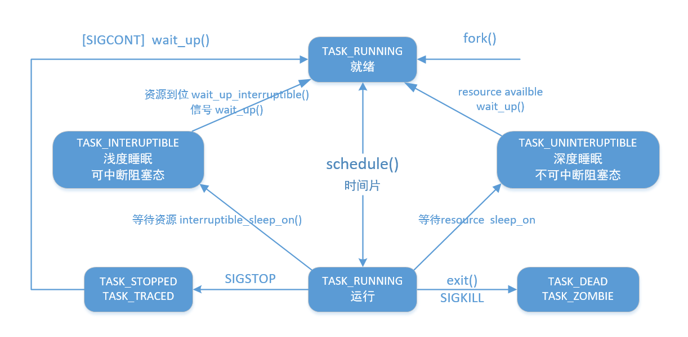

Process
======

进程状态
-----

什么是僵尸进程
-----

正常情况，子进程退出，会有SIGCHLD信号通知父进程。一个进程使用fork创建子进程，如果子进程退出，而父进程并没有调用wait或waitpid获取子进程的状态信息，那么子进程的进程描述符仍然保存在系统中。这种进程称之为僵死进程。

孤儿进程：一个父进程退出，而它的一个或多个子进程还在运行，那么那些子进程将成为孤儿进程。孤儿进程将被init进程(进程号为1)所收养，并由init进程对它们完成状态收集工作。

wait
-----
pid_t wait(int *status);
pid_t waitpid(pid_t pid, int *status, int options);

status

	WIFEXITED(status)
	returns true if the child terminated normally, that is, by calling exit(3) or _exit(2), or by returning from main().
	WEXITSTATUS(status)
	returns the exit status of the child. This consists of the least significant 8 bits of the status argument that the child specified in a call to exit(3) or _exit(2) or as the argument for a return statement in main(). This macro should only be employed if WIFEXITED returned true.
	WIFSIGNALED(status)
	returns true if the child process was terminated by a signal.
	WTERMSIG(status)
	returns the number of the signal that caused the child process to terminate. This macro should only be employed if WIFSIGNALED returned true.
	WCOREDUMP(status)
	returns true if the child produced a core dump. This macro should only be employed if WIFSIGNALED returned true. This macro is not specified in POSIX.1-2001 and is not available on some UNIX implementations (e.g., AIX, SunOS). Only use this enclosed in #ifdef WCOREDUMP ... #endif.
	WIFSTOPPED(status)
	returns true if the child process was stopped by delivery of a signal; this is only possible if the call was done using WUNTRACED or when the child is being traced (see ptrace(2)).
	WSTOPSIG(status)
	returns the number of the signal which caused the child to stop. This macro should only be employed if WIFSTOPPED returned true.
	WIFCONTINUED(status)
	(since Linux 2.6.10) returns true if the child process was resumed by delivery of SIGCONT.

