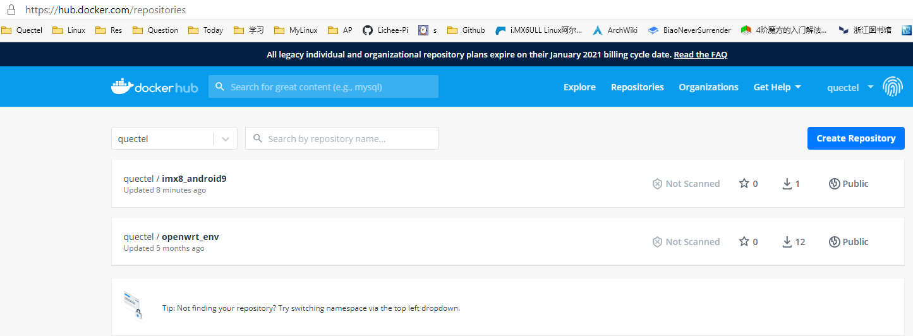

Docker
======

	sudo apt-get install docker.io
	sudo gpasswd -a your_user_name docker               #加入用户组
	sudo service docker restart
	newgrp - docker             #使用新用户组，或者也可以断开终端重连生效
	docker version              #查看docker版本信息

docker下各文件默认存放在/var/lib/docker下

	du -h --max-depth=1 /var/lib/docker                #查看docker目录大小

	docker search licheepi               #搜索镜像
	docker pull zepan/licheepi           #下载镜像
	docker run zepan/licheepi apt-get install -y xxx             #在镜像中执行命令，安装某软件
	docker commit -m="install something" -a="zepan"  container_id zepan/licheepi
	docker login
	docker push  zepan/licheepi

交互式启动

	docker run -i -t learn/tutorial /bin/bash        //开启一个交互式虚拟终端
		-i    交互式
		-t     虚拟终端
		-d    后台
		-P    端口映射

	docker port  id    //查看端口映射情况

	docker inspect  id    //查看容器详细状态

后台启动

	docker run -d learn/tutorial /bin/sh -c "while true; do echo hello world; sleep 1; done"
	返回容器id：350807154a3dd17309b23bb9a9a9897dd3fc91667a7d176aca42f390808e3019

	docker logs 3508 或 blissful_lamport
	docker logs -f    xxxx        //类似tail -f

	docker stop 3508        //通过发送信号方式停止
	docker kill 3508           //kill方式停止
	docker start 3508        //start -i  交互式执行
	docker restart 3508

	docker remove 3508
	docker rm `docker ps -a -q`        //删除所有容器

主机容器互拷数据
	
	docker cp id:/xxx/xx   /yyy/yy/
	docker cp  /yyy/yy/    id:/xxx/xx

开启容器的ssh

	docker run -d -p 6666:22 zepan/licheepi /usr/sbin/sshd -D

push
-----

	android@q-OptiPlex-7070:~$ docker login
	Login with your Docker ID to push and pull images from Docker Hub. If you don't have a Docker ID, head over to https://hub.docker.com to create one.
	Username: quectel
	Password:
	WARNING! Your password will be stored unencrypted in /home/android/.docker/config.json.
	Configure a credential helper to remove this warning. See
	https://docs.docker.com/engine/reference/commandline/login/#credentials-store

	Login Succeeded

	android@q-OptiPlex-7070:~$ docker images
	REPOSITORY            TAG                 IMAGE ID       CREATED          SIZE
	ubuntu                16_jdk1.8           0fc8046dc8e7   10 minutes ago   2.93GB

	docker tag ubuntu:16_jdk1 quectel/imx8_android9

	docker push quectel/imx8_android9

