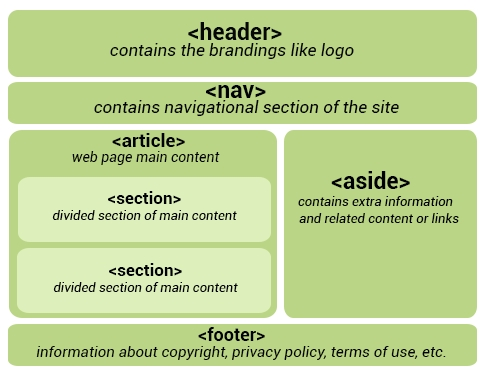

HTML
======

[DOM](https://www.w3school.com.cn/htmldom/dom_events.asp)

DOM
----

DOM 

定义了访问 HTML 和 XML 文档的标准

```
<!DOCTYPE html>
<html>
<body>

<p id="intro">Helweelo World!</p>
<p id="me">本例演示 <b>getElementById</b> 方法！</p>

<script>
x=document.getElementById("me");
document.write("<p>来自 intro 段落的文本：" + x.innerHTML + "</p>");
</script>

</body>
</html>

```

|方法|描述|
|---|---|
| getElementById() | 返回带有指定 ID 的元素。 |
| getElementsByTagName() | 返回包含带有指定标签名称的所有元素的节点列表（集合/节点数组）。 |
| getElementsByClassName() |	返回包含带有指定类名的所有元素的节点列表。|
| appendChild() |	把新的子节点添加到指定节点。|
| removeChild() |	删除子节点。|
| replaceChild() |	替换子节点。|
| insertBefore() |	在指定的子节点前面插入新的子节点。|
| createAttribute() |	创建属性节点。|
| createElement() |	创建元素节点。|
| createTextNode() |	创建文本节点。|
| getAttribute() 	|	返回指定的属性值。|
| setAttribute() 	|	把指定属性设置或修改为指定的值。|

innerHTML 属性

innerHTML 属性可用于获取或改变任意 HTML 元素，包括 <html> 和 <body>。

```
<!DOCTYPE html>
<html>
<body>

<p>Hello World!</p>
<p>DOM 很有用！</p>
<p>本例演示 <b>getElementsByTagName</b> 方法。</p>

<script>
x=document.getElementsByTagName("p");
document.write("第一段的文本: " + x[0].innerHTML);

document.write("第一段的文本: " + x[1].innerHTML);

document.write("第一段的文本: " + x[2].innerHTML);
</script>

</body>
</html>

```

```
<!DOCTYPE html>
<html>
<body>

<p>Hello World!</p>

<div id="main">
<p>DOM 很有用！</p>
<p>本例演示 <b>getElementsByTagName</b> 方法。</p>
</div>

<script>
x=document.getElementById("main").getElementsByTagName("p");
document.write("div 中的第一段的文本: " + x[0].innerHTML);
</script>

</body>
</html>

```
修改

```
<!DOCTYPE html>
<html>
<body>

<p id="p1">Hello World!</p>
<p id="p2">Hello world!</p>

<script>
document.getElementById("p1").innerHTML="New text!";
</script>
<script>
document.getElementById("p2").style.color="blue";
</script>

<script>
var para=document.createElement("p");
var node=document.createTextNode("This is new.");
para.appendChild(node);

var element=document.getElementById("d1");
element.appendChild(para);
</script>

</body>
</html>

```
事件

```

```

导航

```

```

HTML5
------



- **HTML5 的\<header\>和html4的\<head\>标签是完全不一样的**
- article可以取代 div

``` 获取位置信息
<!DOCTYPE html>
<html>
<body>
<p id="demo">点击这个按钮，获得您的坐标：</p>
<button onclick="getLocation()">试一下</button>
<script>
var x=document.getElementById("demo");
function getLocation()
  {
  if (navigator.geolocation)
    {
    navigator.geolocation.getCurrentPosition(showPosition);
    }
  else{x.innerHTML="Geolocation is not supported by this browser.";}
  }
function showPosition(position)
  {
  x.innerHTML="Latitude: " + position.coords.latitude + 
  "<br />Longitude: " + position.coords.longitude;	
  }
</script>
</body>
</html>

```

